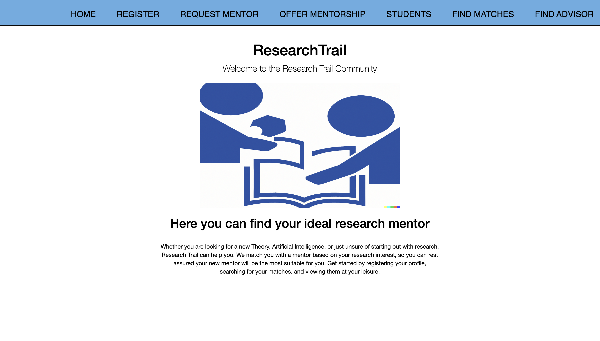

## Bonus Project: Matchapp (JDBC Manipulation), CMSC424, Spring 2023

*This project is to be done individually.*

## **Introduction**

This project should help you gain the skills involved in creating parts of a functional web application that interfaces with a database system using JDBC. We will be creating an application that functions as a Linkedin for research mentorships in the CS department. We will be using Java  to make this happen. In a real world, you will also need a webserver such as Apache Tomcat and HTML (along with JavaScript) to create the entire application. You will be a "Backend developer" in this project since you will be dealing with the back-end (logic tier), and the database system components. To simplify the project, you will not need to work on the front-end (presentation tier) of the application.

## **Relevant Project Files**

To begin this project you will have to pull the project 3 folder from our the repository. Below, we give an overview of the important files that you should know about; all of the other files that are included in the code that you pull are just there to make sure that the application works properly:

* **build.sh**: you should run "./build.sh" in order for your project files to build. This will compile all the necessary files for the application. Make sure you run build in the `matchapp` directory to have it generate and copy the war file to the tomcat directory properly. Run this AFTER starting tomcat to see your website instead of the default tomcat site.

Make sure to run this every time you change your code in order to recompile it. You should also run it while the server is running (more on that later).

* **src/**

    * **.jsp**: These are the Java Server Pages. JSP allows Java code to be interleaved with static web markup content (HTML in our case), with the resulting page being compiled and executed on the server to deliver a complete HTML page. Basically Java is being used to dynamically create HTML pages. A good overview/tutorial on JSP can be found at: [https://www.tutorialspoint.com/jsp/jsp_overview.htm](https://www.tutorialspoint.com/jsp/jsp_overview.htm) (however, you can skip the parts of the tutorial on how to set up the enviornment, since we’ve already done that for you). It is a good idea to check out the other jsp files we are providing you, so that you can get a sense of how each page of the app is generated. You DO NOT need to modify any of this code; the jsp files are for your understanding only. **(Front-end Component)**

    * **com/match/**

        * **model/**

            * **Student.java:** This Java file interfaces with the students table in the matchapp database. We provide basic constructors for a person object but there are several functions missing that you must complete. **(Back-end + DB Component)**

        * **web/**

            * **.java:** These are servlet files that deal with porting over information computed by the **model** files. They help bridge the gap between the back-end and the frontend. **(Back-end + Front-end Components)**

## **Getting Started**

Similar to Project0, you will build the container with `docker build -t "cmsc424-project-bonus" .` in the `project-bonus` directory. Next you will need to start the container using `docker run -v "${PWD}:/home/project-bonus" -ti -p 8080:8080 --name project-bonus  cmsc424-project-bonus:latest` (if you're using cmd on Windows, replace `${PWD}` with `%cd%`). 
You can restart the container with the following commands:

   `docker start project-bonus`
   `docker exec -it project-bonus /bin/bash`


You can quickly start your web application through the following commands:

```bash
/opt/tomcat/bin/startup.sh 
cd /home/project-bonus/matchapp
./build.sh 
```

After executing the commands listed above, navigate to the page localhost:8080 in your browser. If you still see the Tomcat page, wait for a few seconds and refresh, you will eventually see the following page.



 Take some time to view the different pages and examine the format of the website. You may see some error messages until you get the database set up.

More technical details are given in the section below. We will be using tomcat to run our server locally.

* `/opt/tomcat/bin/startup.sh`: Starts your tomcat server

* `/opt/tomcat/bin/shutdown.sh`:  Stops your server

* `./build.sh`:  When executed in the `/home/project-bonus/matchapp` directory, builds all necessary files and copies your **ROOT.war** file to the right tomcat directory.

* ` tail /opt/tomcat/logs/catalina.out`: Checks log file of tomcat server

* `tail /opt/tomcat/logs/localhost.(current-date)`: Checks log file of localhost

You won't be able to debug this web application with print statements like you would for other programs. With Tomcat, you can print values and errors to the log and view the output they produce in the log file. We have set up the log and have included some uses of the logger in the getConnection method but you may want to add your own statements that log information in the methods you write to debug what your program is doing. [Here](https://logging.apache.org/log4j/2.x/manual/messages.html) is a useful link to using the log with examples.

Basically, you can add `logger.info()` and `logger.trace()` statements to print values when your code runs that you can then view the output of in the catalina.out file. If your application isn't behaving as expected or is crashing, add logging statements to your code and view the log to figure out the issue.


Here is which files correspond to which links on the website:
- **404.jsp** - Going to any url that is not set up to be a page on the website  
- **default.jsp** - The home page
- **add.jsp** - The Register link
- **request.jsp** - The Request mentor link
- **offer.jsp** - The Offer mentorship link
- **student.jsp** - The Students link  
- **student.jsp** - The advisor link  
- **generate.jsp** - The Find Matches page  
- **invalid_input.jsp** - Page shown if the user enters invalid input in the Register page  
- **matches.jsp** - The View Matches link  

## **Schema + User**

We already created a database called `matchapp` for you. You should run `\i students.sql` from the psql interface to insert tuples. Make sure you are in the `/home/projec3` directory when you enter the database (`psql matchapp`).

```bash
$ cd /home/project-bonus
$ psql matchapp
matchapp=# \i students.sql
matchapp=# \q
```

The schema is as follows:

* **student**:
    * **id:** This is the primary key of the table, to represent a unique student. This will be of type "serial" which we have not seen yet this semester; this data type auto generates a next unique id to assign to a new student in the table.

    * **first_name:** A string less than or equal to 12 characters long.

    * **last_name:** A string less than or equal to 18 characters long.

    * **email:** A string that is valid email adress.

    * **student_type:** A string representing student type. See the student_type table for a list of all possible student types.

    * **advisor_id:** This is an integer type that references the advisor table's id field.

* **advisors**:

    * **id:** **(Primary Key)**  An integer that represents the id of the advisor. This is also of type serial, although you won't be creating any advisors for this project.

    * **name:** String representing the advisor's name.

    * **field:** String representing what field the advisor specializes in.

    * **experience:** int representing how long the advisor has worked for.

* **needs**:

    * **id:** **(Primary Key)**  An integer that represents the id of the student with the need. This references the student table.

    * **field:** **(Primary Key)** String representing what field the student needs a mentor in.

* **available**:

    * **id:** **(Primary Key)**  An integer that represents the id of the student with the mentorship offer. This references the student table.

    * **organ:** **(Primary Key)** String representing what field the student can provide mentorship in. available. References the fields table.

* **fields**:

    * **fields:** **(Primary Key)**  A string that names fields in computer science.

* **student_type**:

    * **type:** **(Primary Key)**  A string that names a student type.

You will also have to grant all permissions to the pre-created **matchmaker** user to access your database and tables as it will be the one doing the database manipulation. Below are the commands to do this (which you can run in psql or add to a .sql file):

```bash
$ psql matchapp
matchapp=# GRANT ALL PRIVILEGES ON DATABASE matchapp TO matchmaker;
matchapp=# GRANT ALL PRIVILEGES ON ALL TABLES IN SCHEMA public TO matchmaker;
matchapp=# GRANT ALL PRIVILEGES ON ALL SEQUENCES IN SCHEMA public TO matchmaker;
matchapp=# \q
```

# Your Tasks

## **Person.java: Back-end + DB (17 points)**

You will need to complete the following methods in the `Student.java` model file that interfaces with the `students table` in the matchapp database. We have already completed a few of these methods, including the constructors as well as functions that interface with your database remotely and locally. You have to complete:

* **getStudents():** Get a list of all the students in the database. (1.5pts)

* **getStudent(String sid):** Get a specific student given a value for the id attribute. (1.5pts)

* **getStudentSearch(String substring):** Return students in the student table that have an attribute that have a substring match with the query. (1.5pts)

* **addStudent(String first, String last, String email, String student_type):** Add a student with the specified values in the student table. Should leave advisor_id null.  (1.5pts)

* **getMentorMatches(String id):** Get everyone who can mentor this student. Should use your `computeOrganMatch()` to check the compatibility of each potential match. (1.5pts)

* **addMentorNeeded(Field f, int sid):** Add a needed mentor to the database for the given student and field. (1.5pts)

* **addMentorAvailable(Field f, int sid):** Add an available mentor to the database for given student and field. (1.5pts)

* **computeMentorMatch(int menteeID, int mentorID):** Check if the two people given are compatible for a mentorship. (2pts)

* **getStudentWithAdvisor(int sid)** Return a Student object with the advisor details filled into the corresponding variables.(1.5pts)

* **getAdvisorFirst(int sid):** Assign an advisor to a newly registered student. See the method comments for more details on how to do that. (1.5pts)

* **getAdvisorUpdate(Field f,int sid):** Assign a new advisor to someone who registers a field. See the method comments for more details on how to do that. (1.5pts)


The `Student.java` file has comments above each method with more details about what each method should do. We will be testing each of these methods individually to ensure that they produce the output as specified by the comments above each method on a database with different students and advisors that we make. The data we test it on will be exactly the same as the form we have given to you in `students.sql` --- only the actual values will be different.  

You may want to add a main function in `Student.java` to test each function you modified. For example:

```java
public static void main(String [] args) {
  Person[] students = Student.getStudents();
    for (Student s : students) {
      System.out.println(s.getFirstName() + " " + s.getLastName());
    }
}
```

To run `Student.java`:

```bash
cd /home/project-bonus/matchapp
./build.sh
cd src/WEB-INF
java -classpath "lib/*:classes/.:." com.match.model.Student
```

**The following resources may help you in writing this code:**

[Creating Statements](https://docs.oracle.com/javase/tutorial/jdbc/basics/processingsqlstatements.html#creating_statements)

[Prepared Statements](https://docs.oracle.com/javase/tutorial/jdbc/basics/prepared.html)

## **Connecting Back-end + Front-end (3 points)**

Now that you have successfully finished the majority of the back-end (logic tier) components, you will now have to hook up the back-end with the front-end components. This process will be done via the Java files in the **matchapp/src/com/match/web** directory. You will complete the TODO stubs found in the `doPost()` methods of **AddStudent.java**, **AddOffer.java**, and **AddRequest.java**.


# Testing

**We do not provide you with a testing file like the first two projects, but if you follow the steps below, it should give you a good idea of whether or not your project is working correctly.**

1. To start, ensure that your database is properly created and set up by following the steps in the *Schema + User* section. You should also be running the server and have built the project. Steps for this can be found in the *Getting Started* section. In your Docker container, run `psql matchapp`. We will use the psql interface to verify that your queries are working correctly.
2. In a browser, go to `localhost:8080`. The OrganTrail home page should be visible. If not, try refreshing the page a couple times or rebuilding the project. Also make sure the server is running.
3. Click on the `register` tab. Enter any first name, last name, and email. Then select the student type. Click submit. You should see the id and advisor id of your created student. If this is the first student you have registered, it should be id 101 and advisor 2.
4. Now create another student, but this time make the email id invalid. You should be redirected to an invalid input page.
5. Navigate to the `Student` tab. You should see a list of 10 people. Now, enter your registered student's first name into the search bar and press submit. You should see your created student come up. Do the same with last name, and email. For student type, you may not see your student since there are more than 10 people with any student type. You can verify that all of the students returned have the same student type using the psql command line.
6. Go to the `Find Matches` page. Enter your student's id. It should display nothing (not 'No Matches').
7. Now go to the `Request Mentor` tab. Enter your person's id,  and some field. Your advisor's id should be changed. Check that it was also changed in the database. You should also check that this advisors's field is the same. 
8. Click on the `Find Matches` tab. Enter your student's id and click generate match. You should some names. Verify in the database that everyone you see is present in the available table with the same field.
9. Now, go to the offer Mentorship tab, and offer your person's mentorship in some field. Your student's advisor should be changed again. 
10. Navigate to the `Advisor` tab. Enter your student's id and get the advisor information on the page.

**This testing is meant to give you a feel of how your project should work. It is not all-encompassing and we encourage you to more vigorously test your site.**


# **Submission**

To submit the project, zip the matchapp folder into a zip file named **matchapp.zip** and submit via Gradescope. The autograder requires the folder to be the root folder of the zip file to execute successfully.
 
