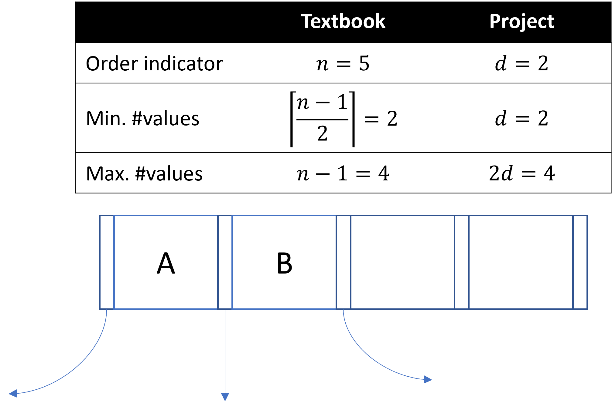

# **Project 3: B+ Trees**

This project is to be done by yourself.

## **Introduction**

This project was adapted from a B+ tree implementation project originally developed at the University of California Berkeley. The goal of this project is to give you a deeper understanding of how B+ trees work. The best way to accomplish this is by building one yourself. Do not fear, you will not be writing this from scratch!  Methods you will need to implement will have comments telling you what to do.  More on this later.

## **Environment**

For this project, we highly recommend you install/use an IDE like [Eclipse](https://www.eclipse.org/downloads/). In Eclipse, import this project with: File > import > maven > existing maven project.

Alternatively, you can run the project within a Docker environment, which can be started with the following command. Make sure that the current directory is the directory of the project:

```bash
docker run -v $PWD:/project3 -ti --rm -w /project3 maven:3.9.0-eclipse-temurin-17-alpine /bin/bash
```

In the terminal of the Docker container, you can compile and run the tests with the following commands:

```bash
    # build code without testing
    mvn compile
    # build code and run unit tests
    mvn test
```

## **The Project Files**

To begin, pull the Project 3 folder from our repository as always.  Here is a brief overview.  You should primarily be focused on the contents of the index directory:

### index
The 'index' directory contains all the files that you will need to edit, specifically, LeafNode.java, InnerNode.java, and BPlusTree.java.  

* **BPlusNode.java**: An abstract class for LeafNode and InnerNode. This contains very important information on how to implement methods in those two classes.  Make sure you follow what is written here!

* **LeafNode.java**: Leaf nodes class.  You will need to implement some methods in this.

* **InnerNode.java**: Inner nodes class.  You will need to implement some methods in this.

* **BPlusTree.java**: B+ Tree class.  This is the structure that will hold LeafNodes and InnerNodes.  You will need to implement some methods in this.

### common
The 'common' directory contains miscellaneous but handy bits of code.

### databox
The 'databox' directory contains classes which represent the values stored in a database as well as their types. Specifically, the DataBox class represents values and the Type class represents types. Here's an example:

```java
DataBox x = new IntDataBox(42); // The integer value '42'.
Type t = Type.intType();        // The type 'int'.
Type xsType = x.type();         // Get x's type: Type.intType()
int y = x.getInt();             // Get x's value: 42
String s = x.getString();       // An exception is thrown.
```

### io
The `io` directory contains code that allows you to allocate, read, and write
pages to and from a file. All modifications to the pages of the file are
persisted to the file. The two main classes of this directory are
`PageAllocator` which can be used to allocate pages in a file, and `Page` which
represents pages in the file.  Below are some examples of how this works so you can get an idea of it:

Here is an example of how to persist data into a file using a `PageAllocator`:

```java
// Create a page allocator which stores data in the file "foo.data". Setting
// wipe to true clears out any data that may have previously been in the file.
bool wipe = true;
PageAllocator allocator = new PageAllocator("foo.data", wipe);

// Allocate a page in the file. All pages are assigned a unique page number
// which can be used to fetch the page.
int pageNum = allocator.allocPage(); // The page number of the allocated page.
Page page = allocator.fetchPage(pageNum); // The page we just allocated.
System.out.println(pageNum); // 0. Page numbers are assigned 0, 1, 2, ...

// Write data into the page. All data written to the page is persisted in the
// file automatically.
Buffer buf = page.getBuffer(transaction);
buf.putInt(42);
buf.putInt(9001);
```

Here is an example of how to read data that's been persisted to a file:

```java
// Create a page allocator which stores data in the file "foo.data". Setting
// wipe to false means that this page allocator can read any data that was
// previously stored in "foo.data".
bool wipe = false;
PageAllocator allocator = new PageAllocator("foo.data", wipe);

// Fetch the page we previously allocated.
Page page = allocator.fetchPage(0);

// Read the data we previously wrote.
Buffer buf = page.getBuffer(transaction);
int x = buf.getInt(); // 42
int y = buf.getInt(); // 9001
```

### table
The 'table' directory used to contain other table related things but you only need the 'RecordId' class which uniquely identifies a record on a page by its page number and entry number:

```java
// The jth record on the ith page.
RecordId rid = new RecordId(i, (short) j);
```

There are a few other files that are used to make the tests work that you are welcome to look at if you need to.

## **Your Tasks**
1. Familiarize yourself with the code in the 'index' directory.  Here is a repeat of a few critical points:
    - Our implementation of B+ trees does not support duplicate keys. You need to throw an exception whenever a duplicate key is inserted.
    - Our implementation of B+ trees assumes that inner nodes and leaf nodes can be serialized on a single page. You do not have to support nodes that span multiple pages.
    - Our implementation of delete does not rebalance the tree. Thus, the rule that all non-root leaf nodes in a B+ tree of order `d` contain between `d` and `2d` entries will not hold for this project. Note that actual B+ trees **do rebalance** after deletion, but we will **not** be implementing rebalancing trees in this project for the sake of simplicity.  This means you also do not need to account for cases where inner nodes may be deleted.  
2. Implement the `LeafNode::fromBytes` function that reads a `LeafNode` from a page. For information on how a leaf node is serialized, see `LeafNode::toBytes`. For an example on how to read a node from disk, see `InnerNode::fromBytes`.
3. Implement the `get`, `getLeftmostLeaf`, `getRightmostLeaf`, `put`, `remove`, and `bulkLoad` methods of `LeafNode` and `InnerNode`. For information on what these methods do, refer to the comments in `BPlusNode`. Don't forget to call `sync` when implementing `put`, `remove`, and `bulkLoad`.
4. Implement the `get`, `put`, `remove`, and `bulkLoad` methods of `BPlusTree`. 

## **Things to Note**

1. This project uses a variable `d` to describe the "order" of a B+ Tree, and `2d` as the number of **values** in a node (this is true both for leaf nodes and internal nodes). In contrast, the textbook we are using for our class uses a variable `n`, which is defined as the number of **pointers** in a node. Every node in a B+ tree--both leaf nodes and internal nodes--have one more pointer than value, so the `n` from your textbook is always equal to `2d + 1`.

    Therefore, this sentence in the textbook 
    > Each leaf can hold up to n − 1 values. We allow leaf nodes to contain as few as ceiling[ (n−1)/2 ] values.
    
    translates to 
    > Each leaf can hold between d and 2d values, inclusively. 
    
    in this project. For example, here is a node with `n = 5` (or `d = 2`).
    
    

    Thus, there is no difference between the size constraints of nodes between this project and your textbook. You should be aware of how `d` is defined and how `n` is defined, and how `n = 2d + 1`, for quizzes and exams.

2. The order `d` of a B+ Tree is given upon the tree's creation within its metadata field which is passed onto its inner nodes and leaf nodes.
3. Although there are a lot of files included in this project, you do not need to have a robust understanding of them except for the methods in the index directory that you need to implement.
4. You may not modify the signature of any methods or classes that we provide to you, but you're free to add helper methods in LeafNode.java, InnerNode.java, and BPlusTree.java.

## **Testing**
All of the tests for this project are in the `edu.berkeley.cs186.database.index` package in the `src/test/java` folder.  These will be the only tests we use to run your project.  In Eclipse, you can run the tests by going to your Package Explorer > right-click on the `edu.berkeley.cs186.database.index` package > Run As > JUnit Test.  You can also right-click on the individual tests to run them separately.

## **Submitting**
Just submit your LeafNode.java, InnerNode.java, and BPlusTree.java to Gradescope.
